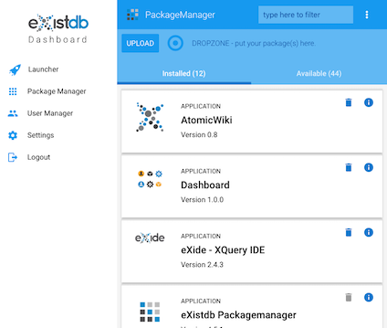
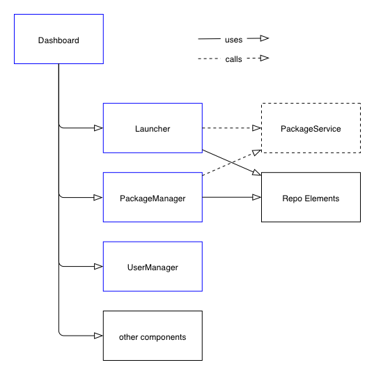

# eXist-db and Web Components - Part 2

by Joern Turner, 6. April 2018

In Part 1 i gave a high-level overview of what Web Components actually are and which problems
they solve.


In this part we'll look into the use of Web Components as part of an eXist-db application that serves as an example
for a componentized application (actually several as we learn later) and discuss what this approach has to offer. Some
 of this certainly applies to Web Component applications in general while other aspects will deal with specifics of
eXist-db applications.



## Disclaimer

Yes, Web Components are still young and not all parts have been finalized in standards yet. There have been other
brilliant standards that didn't make it into real world. That much for a warning.



However there strong indicators that Web Components have a good chance to make the race and get broadly available in
all major browsers and being adopted by solution engineers.



## Use the platform Luke!


In this article we'll use the eXist-db dashboard application to illustrate the use of Web Components.
The original application was built using the Dojo Toolkit, a typical JavaScript framework which is still around. Dojo is
 extremely feature-rich (actually too rich as it turned out) and certainly allows to build the most complex browser applications you can think of. So why change?

Being involved with a lot of different technologies from day to day we found that Dojo was too demanding to maintain in
the long run. If you don't live it all the time you'll die from it. In the end there was nobody around any more that had the skills and nerves to further keep it alive from update to update.


To avoid hitting that trap again a rewrite of the application should build on the native browser platform and standards
as far as possible. As an open source project eXist-db already uses open standards everywhere. This ensures that our users can contribute more easily, use broadly available tools and documentation and make sure that the knowledge to
aintain things over time does not vanish when fashion changes.

To bypass the framework trouble we therefore decided to go with Web Components as an emerging standard and to use
Polymer to ease that transition.

## What is Polymer?

[Polymer](https://polymer-project.org) has already been mentioned in part 1 but needs a slightly deeper introduction here.



But stop - just stated that frameworks are problematic and now promoting another one? It is important to understand that
 Polymer is not a framework and does not lock us into using it forever. Polymer is built on top of [webcomponentsjs](https://github.com/WebComponents/webcomponentsjs) which
is a vendor-independent [polyfill](https://www.webcomponents.org/polyfills/) for Web Components. It fills the gaps
 for browsers that do not have a full native implementation yet. webcomponentsjs is not just used by Polymer but e.g. also by
 [Bosonic](https://bosonic.github.io/) and [x-tag](https://x-tag.github.io/).


Polymer adds some convenience on top of webcomponentsjs such as data-binding, templating and tooling support that help
 speeding up the development process. The [Polymer CLI](https://www.polymer-project.org/2.0/docs/tools/polymer-cli) for
 instance allows to quickly create new components or even
 a complete app with just one command. Further it allows to create optimized builds and helps with testing.


But doesn't that provoke another lock-in? To be honest the answer will be 'yes and no'. 'yes' cause you get a lot of
 convenience from using Polymer and might not be happy to give that up and 'no' cause the components themselves just use
 the API of webcomponentsjs which just polyfills the features of the HTML5 platform. The convenience part certainly can
be substituted with minimal changes to the code.



## Obstacles and challenges

As with any new technology there are certainly also coming some challenges. Web Components largely use the common DOM
API but extend it especially for Shadow DOM and for handling the lifecycle of a component. While these are easy to learn for any JavaScript developer the specifics of Shadow DOM can give you some headaches here and there.



Over the years we have become so much used to navigating the whole documents' DOM that the concept of encapsulation
enforces some rethinking of the approaches to application building with JavaScript and HTML. No more dirty tricks to switch a CSS class here and there to reflect some application state. No more event trapping as it bubbles up the documents'
OM.

You can't have a global CSS any more that controls everything in the page and you cannot access certain elements in the
 page from a global scope when they actually live in the Shadow DOM.



This is a good thing as it enforces a much more modular approach and thinking about the design of your application. It
also forces you to think about the purpose of your components and how to fit them together. You might find yourself
 in situations asking 'why is this simple thing so tough?'



You'll need to think about your components as independent islands that should work by themselves ignoring the context
 they are used in. Practices and tools you may have used earlier don't work any more and you need new answers to apply
 theming or communication between the views of your app. However by mastering these challenges you're rewarded with a
much cleaner, modular and robust application.



Another challenge is your code organisation. While you were probably used to having all of your app in a single
 Git repository you'll need to rethink that also. Web Components promote a model where you group several related components
in one repository and to import them into your final product as a dependency. This creates a bit more work in the first place but in the end gives you a chance to reuse what you've created elsewhere.



This seems to be the right place to mention the documentation. Polymer docs are quite good but even with the best
 docs you'll find yourself searching for answers to design questions. Stackoverflow and
 [Google's Web Fundamentals](https://developers.google.com/web/fundamentals/) can be a very good source here. Finally
 not to forget the very good video tutorials on youtube (search for 'polycast').


Last but not least Polymer itself and Web Components are still not settled in some areas which may lead to some confusion
 about which version you actually want to use. In eXist-db we're going with the latest stable version 2.x which turned out
 to be very reliable so far. Sometimes you may encounter some different behavior in e.g. Chrome versus Firefox but
 these are manageable and most of the time have to do with CSS encapsulation or event handling.



With the release of Polymer 3 things will change again as it seems that HTML imports will not be adapted for the final
standard but be replaced by ES6 modules for loading the dependencies. It worth noting here that the Polymer team will
 offer an automated tool for the migration then. This is already in active use during the development of 3.0.



## eXist-db applications


In this section we finally dive into using Web Components as part of eXist-db applications.

eXist-db evolved as a native XML database but over the years grew into a full application platform. Complete applications
 can be packaged in an archive (zip format) and uploaded and installed within the database itself. Along with some version
 and dependency tracking this allows to easily distribute and update applications.



A metadata file (repo.xml) will hold the applications name, authors, license and further descriptors as well as allow
 pre- and post-installation hooks. Once installed the application will end up in a defined collection in the database and
be served by the embedded jetty server that is part of the platform (other deployment options exist that won't get a
 mention here).



An application will usually consist of client-side code and resources (CSS, images) as well as a controller that maps
requests to resources and of course some server-side code. As an XML platform XQuery is usually used to access
 data and generate some XML, HTML or JSON output. Application archives are also called xars as they use a '.xar' extension.


## the eXist-db Dashboard application



Before the new architecture is described we need a basic understanding of the established app to point out the
 differences in both.



The [eXist-db](https://exist-db.org) Dashboard comes bundled with each eXist-db download and allows to administer the application platform
by offering the following functionalities:



* uploading
* updating
* installation and removal of xar packages

* managing users and groups
* launch applications

* trigger backups

* browse the database etc.


The application was built as a single-page application with several modules being plugged into the main window.

There
 were:


* a PackageManager for handling the xar packages
* a UserManager
* a Lauchpad
* a backup screen

* and several others of minor importance which i'll leave away for the remainder of this paper




## the eXist-db world - hybrid application components

The original Dashboard has been around for several years now. In the meantime we learned about new use cases - some users
don't want a Launcher app for their installations as they host just a single default application. Others don't want a PackageManager
 to be available on their production system.



To cut it short it would be desirable that each of these functional
 modules could be made available as a standalone application or as an integrated part
of the Dashboard. The new Dashboard offers exactly that with the help of Web Components.

The following screenshot illustrates this.






It shows the new Dashboard which uses a responsive drawer layout. This btw is one of the thousands of ready-made
components you can get from webcomponents.org. In the drawer on the left you see the modules the dashboard consists of.
 The panel on the right shows the PackageManager being currently selected. Each of the pages on the right are bookmarkable for quick access.

In essence the Dashboard is not much more than a layout wrapper that provides a navigation for the single components
 on the right.



On the other hand the following screenshot shows the PackageManager as a standalone eXist-db app.






The only difference in code are the additional
 meta descriptor files that eXist-db needs to install the package as an application. Therefore i used the term 'hybrid' in
the title of this section - the PackageManager lives in its own git repository being deployable as a standalone app or as a integral component of Dashboard. It has a hybrid nature.


The following diagram shows the use of the different components in the Dashboard.





Each of the shown items live in their own git repository and are designed to be independent of each other. They are
 then pulled together with [bower](https://bower.io/) which is a client-side dependency management tool. The blue boxes
 represent 'hybrid components'. For completeness also the 'PackageService' is mentioned. This is a headless service
 that is used by the 'Launcher' and 'PackageManager' apps to fetch the available packages from the server and display
 them in an app-specific way.


### Using a hybrid as a component



To actually use a component it needs to be pulled into the project.



E.g. a simple
```bower install --save https://github.com/eXist-db/packagemanager/archive/v4.5.1.zip```



pulls the PackageManager component into the local dependency directory of Dashboard. The dependencies are all kept
in a file called ```bower.json```.

When time for an update comes a simple ```bower update``` will do the trick.


### Using a hybrid standalone

eXist-db apps are usually build with Apache Ant. There is a ready-made build-file for you whenever you create an app. There's no
build step  - it basically just creates a zip with a '.xar' extension. To build
 your app you simply have to call:


```
ant
```

The result will be a xar application ready to be deployed on any eXist-db installation.


### where we go beyond ...


As laid out above eXist-db applications go beyond just the front-end. Instead they handle data, server-side logic,
 an application controller and all client-side resources all in one package.



Now hat does happen to this logic when used in another context like the Dashboard? Fortunately bower
 doesn' care about what is loaded inside as a dependency so once we've done our ```bower install``` we'll have
 all of the required XQuery files and other related resources loaded
into our ```bower_components``` folder.



You then up with a project structure like this:


- Dashboard root
  - bower_components
      - existdb-packagemanager
       - modules/ (all XQuery stuff)

       - controller.xql

       - existdb-packagemanager.html
- ... other files and dirs
- controller.xql (Dashboard controller)

Now what happens with the controller logic? Fortunately eXist-db is clever enough to work that out for us. It detects
the existence of controller and routes requests accordingly.



An example illustrates this:



e.g. UserManager defines a REST-style mapping for the URL ```/api/users``` that will trigger an XQuery script to
 return a list of users. When running UserManager standalone the request URL will be ```/usermanager/api/users```.


However when UserManager is called within Dashboard eXist-db routes this request to ```/dashboard/bower_components/existdb-usermanager/api/users```.
It finds the controller.xql in that subdirectory and will execute it.


This feature allows us to keep the components/apps separate and use them into different context without changing a single line of code.



## The good, bad and ugly

The transition from the old Dashboard to a newer one was a necessary step to free us from the lock-in
 situation we had with using Dojo. But how does the result of that transition looks like?

All in all the new Dashboard gives a whole lot of new options to further refine and extend the respective
components. It is easy to go from here and plug new components as well as extend the existing ones. It feels good to mostly build upon established or upcoming HTML5 features. The use of ready-made standard components speeded up
he work a lot and makes sure you don't reinvent the wheel. The result looks modern and familiar as it builds
 upon Google Material Design guidelines.



With great power there comes increased responsibility:



* we have a bunch of repositories to look after instead of just one
* there's certainly a learning curve to master to find your way in this new world. I confess i was stuck not
 just once in reasoning about the right way of designing a component or how to apply
 a certain styling to it. So it needs some digging in the internet to find your way around.


Now that these hurdles are taken i could not help but recommend to look into Web Components as they offer a
significant paradigm change for the front-end world. Today JavaScript frameworks and libraries dominate the front-end - certainly for a reason but nevertheless they stay foreign to the browser and
 (their biggest disadvantage) are not easy to migrate away from as each uses its own
 custom API.


Web Components on the other hand have a good chance becoming a native feature of each browser offering a solid
 foundation for building apps from components.



This part was on Web Components for building eXist-db apps. Next part will be on Web Components and how they can help in
 an XML world.








